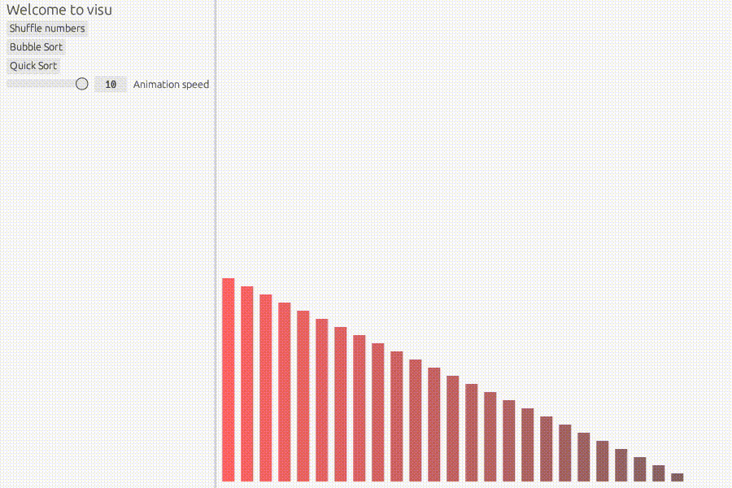

# `visu` - Visualize Algorithms

`visu` is a GUI algorithm visualizer and helps with understanding how algorithms
work. It started in [Hackweek 22](https://hackweek.opensuse.org/) with bubble sort and quick sort.

